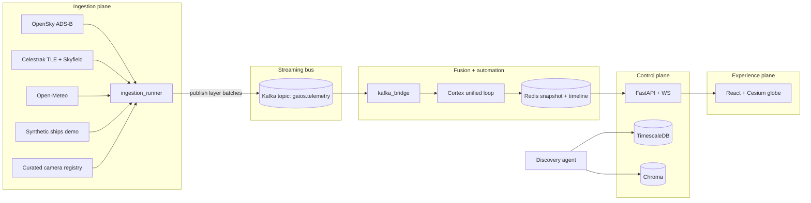

# GAIOS architecture

This document explains how the subsystems fit together and how the autonomous agents reason over data.

## System diagram

## Data flow (real-time)

1. `ingestion_runner` pulls public feeds on staggered intervals, normalizes entities, and publishes JSON envelopes to Kafka (`gaios.telemetry`) keyed by layer (`aircraft`, `satellites`, `weather`, `ships`, `cameras`).
2. `kafka_bridge` consumes the stream and invokes **`cortex.cycle.run_kafka_intel_tick`**: load goals → fused perception and multi-agent reasoning (`intel/orchestrator.build_snapshot`) → persist fusion/decisions/metrics → goal planning, execution, and critic feedback → episodic Chroma upsert → attach `meta.cortex` + `meta.strategy`. The bridge then writes `gaios:snapshot:latest` to Redis and appends to `gaios:timeline` for replay.
3. `api` serves REST (`/layers/snapshot`, `/intel/*`, `/alerts`, `/discovery/run`) and pushes the same snapshot over WebSocket (`/ws/live`) for sub-second UI refresh.

## Autonomous discovery engine

The discovery agent is deliberately conservative:

- It seeds from configurable catalog pages (`DISCOVERY_SEED_URLS`).
- It extracts outbound links, scores them with deterministic heuristics (file types, API keywords, open-data hosts).
- If `OPENAI_API_KEY` is present, it optionally re-scores candidates with a compact LLM prompt (classification, not browsing).
- Accepted candidates are upserted into **Chroma** (`public_sources` collection) for semantic retrieval and inserted into Postgres `sources` when not already registered.

This provides a **framework** for “self-integrating” sources: wire your own validators, schema mappers, and ETL jobs behind the `sources` table.

## Cortex (unified loop)

Goals are the driver: **`compute_goal_bias`** adjusts Redis-backed thresholds before detection; the **strategist** receives `goal_severity_lift`. **Planner** may open a new plan from fused events *or* material strategist decisions; **executor** advances stored plans; **critic** (`cortex.critic`) records plan feedback and nudges goal priorities. **Memory** runs after the plan phase so Chroma episodes include execution status. Agent names in `meta.cortex.agents` map to existing modules (`cortex/agents.py` roster).

### Meta-learning (non-blocking)

**Evolution** (`meta_learning/evolution_agent.py`) runs on a timer in a background task from `kafka_bridge`—it never blocks the cognitive tick. It reads `strategy_memory`, updates `strategy_rankings`, scores **sandbox** candidates against historical episodes (`meta_learning/sandbox.py`), logs `sandbox_results`, and may write **`gaios:meta:evolution:guidance`** in Redis. **Cortex** loads that payload first, merges **`threshold_deltas`** into adaptive thresholds (then goal bias), applies **`severity_lift_delta`** to strategist lift, passes **`decision_confidence_boost`** into `run_strategic_agent`, and sets **`planner_profile`** (`template` vs `openai`) for the planner. Episode outcomes reuse **`plan_execution_score`** from `learning/execution_scores.py` (same scoring path as the critic’s feedback).

**Evolutionary extension** (`meta_learning/evolutionary/`): when enabled, the evolution pass **generates** multiple guidance variants from top fingerprint seeds (`strategy_generator.py`), **scores them in parallel** offline (`competition.py` composes lift from `evaluate_candidate_vs_history`, stability via bootstrap on the same weighted scores, efficiency via `threshold_delta_l1_norm`), **selects** a winner (`selection.py`), writes **`sandbox_results`** per variant, persists the winner into **`strategy_memory`** with `deployment=offline_evolved`, and updates Redis guidance. With `EVOLUTIONARY_ENABLED=false`, the code falls back to the original single random mutation path.

## AI analysis layer

- **Anomaly agent**: maintains rolling counts for aircraft/ships; applies z-score tails to detect surges/drops and emits structured alerts in the snapshot.
- **Correlation engine**: performs a lightweight spatial join between high-wind weather cells and dense air traffic pockets to surface “wind–traffic coupling” hypotheses.
- **Predictive module** (`agents/predictive.py` + bridge forecast metadata): simple linear extrapolation over short windows as a placeholder for calibrated forecasting services.

## Frontend (Cesium)

The UI renders high-volume layers using `PointPrimitiveCollection` primitives (not thousands of individual `Entity` objects) for throughput, optional heat clusters as translucent ground ellipses, and a replay slider backed by `/intel/timeline`.

## Observability

`prometheus-fastapi-instrumentator` exposes `/metrics` on the API service; Grafana is pre-provisioned in Compose for dashboards you can extend (Kafka lag, scrape health, custom counters).

## Hardening checklist for production

- Replace synthetic maritime traffic with a licensed AIS feed and harden ingestion auth.
- Add TLS termination (Ingress or reverse proxy), JWT auth for operator APIs, and secrets management.
- Scale Kafka/Redis/DB via managed services; split `bridge` into multiple consumer groups for partition scaling.
- Add schema validation (e.g. pydantic v2 strict models + JSON Schema registry) at the Kafka edge.
